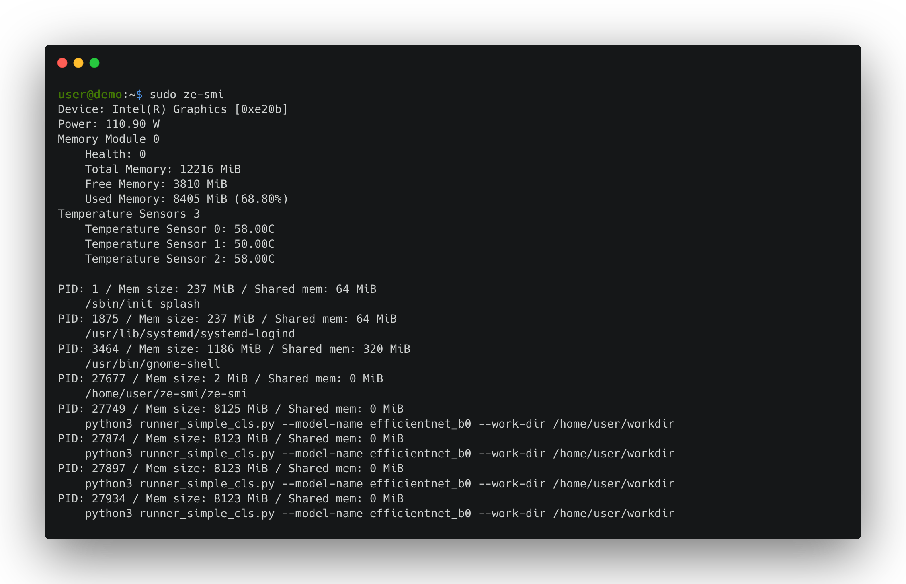

# ze-smi
A tool to display information about Level Zero devices.
Built using libze and libze-dev



## Environment
 * Ubuntu 24.10
 * 6.11 kernel or newer, please use most recent kernel from gitlab.freedesktop.org/drm/xe/kernel for more features on Battlemage, such as temperature monitoring.

## Build
```
g++ -o ze-smi main.cpp -I/usr/local/include/level_zero -L/usr/local/lib -lze_loader -std=c++17 -pthread
gcc ze_xe_cores.c -o ze_xe_cores -lze_loader
```

## Run
Use `sudo` for more details!
